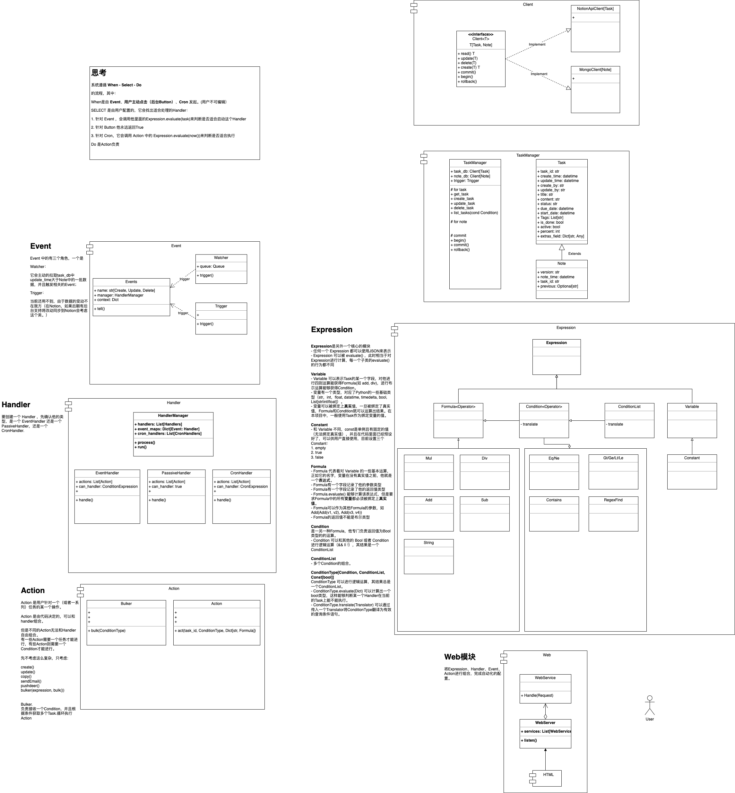

This project is under heavy constructions.

# notion-self-management

turn notion into a simple project management tool with automation.

## 1. Why

[trello](https://trello.com/) is a good project management for individuals and teams.Butler(Automation function) and Power-Up(Plugins) made trello more powerful. 

Sadly, Butler has a [limit](https://support.atlassian.com/trello/docs/butler-quotas-and-limits/) to the command runs per month for free and standard plan.

[Notion's](https://notion.so) database can be a great replacement for individual project management. But it hasn't have any automation function for now.

Luckily, Notion's API is open for the developer, This project is meant to use Notion's API to add Notion's database with a trello-like automation function.

## 2. Requirements

python3.8+

## 3. Installation

## 4. Modules

> This project is under heavy constructions any break changes may occur.
